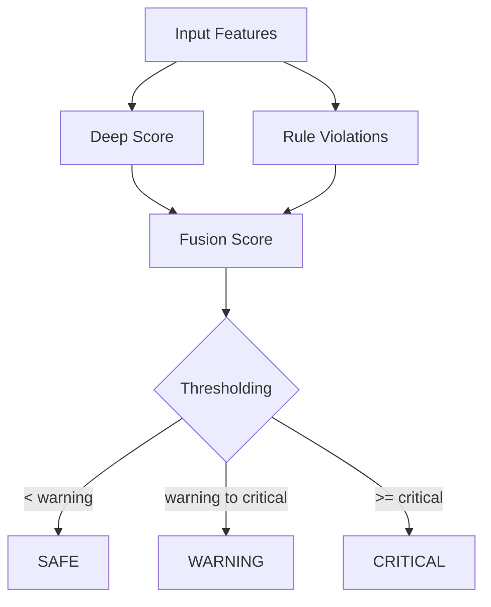

# Safety Sentinel Algorithm

## Objective

Compute near-miss risk per frame/window by fusing:
- Deep anomaly score
- Classical safety-rule violations

## Hybrid Decision Logic

## Inputs

Common feature inputs include:
- Minimum vehicle-pedestrian distance
- Minimum vehicle-vehicle distance
- Maximum speed
- Maximum closing speed
- Minimum time-to-collision (TTC)
- Pedestrian presence and conflict count

## Classical Rule Path

Rules are evaluated with warning and critical thresholds.
Typical checks:
- Vehicle-pedestrian distance
- Vehicle-vehicle distance
- Speed severity
- Closing speed severity
- TTC severity
- Mixed traffic proximity

The rule engine outputs:
- Boolean violation map
- Warning count
- Critical count

## Fusion Formula

Let:
- `D` = deep anomaly score in [0, 1]
- `C` = classical violation score in [0, 1]
- `R` = additional risk terms (distance/speed/ped interaction mix)

Final score:

`risk = w_d * D + w_c * C + w_r * R`

with default weight intent:
- `w_d` deep emphasis
- `w_c` rule emphasis
- `w_r` contextual risk emphasis

An optional boost is applied for strongly critical combinations.

## Classification

Using current thresholds in code:
- `SAFE` if `risk < warning_threshold`
- `WARNING` if `warning_threshold <= risk < critical_threshold`
- `CRITICAL` if `risk >= critical_threshold`

## Why This Hybrid Approach

- Deep path catches subtle temporal anomalies.
- Rule path keeps decisions explainable.
- Fusion improves robustness over either path alone.

## Calibration Guidance

For new camera scenes:
- Recalibrate distance and speed thresholds.
- Validate warning/critical cutoffs on scene-specific data.
- Tune fusion weights to balance sensitivity and false alarms.
