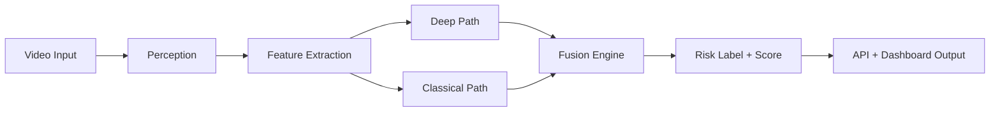
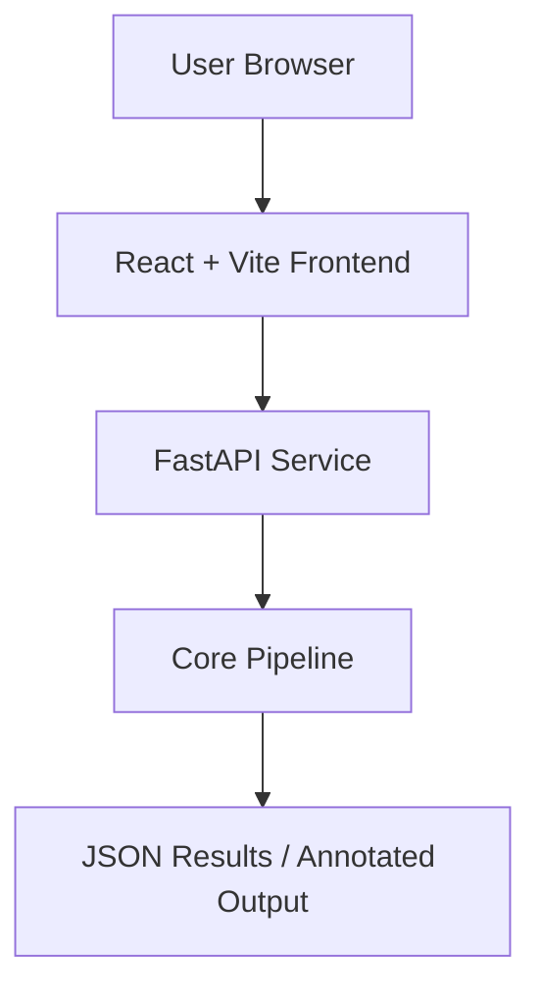

# Safety Sentinel Architecture

## System Summary

Safety Sentinel is a hybrid pipeline for near-miss detection in traffic videos.
It combines a deep temporal signal with interpretable classical rules, then fuses both into one risk decision.

## High-Level Flow

## Component Breakdown

### 1. Perception (`core/perception.py`)

Responsibilities:
- Object detection from frames.
- Multi-object tracking across frames.
- Normalized object state output for downstream modules.

Output examples:
- Class label (`car`, `truck`, `bus`, `bicycle`, `motorcycle`, `person`)
- Bounding box and confidence
- Track ID and trajectory history

### 2. Feature Extraction (`core/features.py`)

Responsibilities:
- Build numerical features from tracked objects.
- Compute interaction features between actor pairs.

Feature groups:
- Spatial: distances between vehicles and pedestrians/vehicles
- Temporal: speed and closing speed
- Interaction: TTC and conflict indicators

### 3. Decision Engine (`core/decision.py`)

Responsibilities:
- Evaluate deterministic rule violations.
- Combine rule outcomes with deep anomaly signal.
- Produce final risk score and label.

Label policy:
- `SAFE`
- `WARNING`
- `CRITICAL`

### 4. Backend API (`main.py`, `pipeline.py`)

Responsibilities:
- Expose FastAPI endpoints.
- Run end-to-end inference pipeline.
- Return structured output for UI consumption.

### 5. Frontend (`frontend/`)

Responsibilities:
- Upload/playback UI.
- Visual display for risk levels and alerts.
- Present outputs from backend inference.

## Deployment View

## Current Notes

- The project is evolving; thresholds and fusion weights are expected to change.
- Dataset and heavyweight artifacts are intentionally kept out of Git history.
